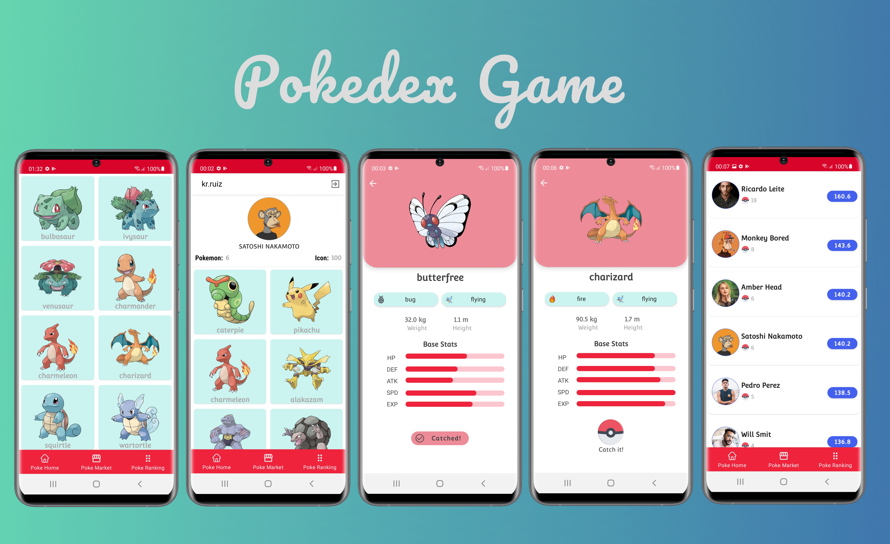

# **Pokedex Game**

```
Pokedex Game is an app which we can play catch Pokemon with your friends. 
Gain some experience knowledge and be the Pokemon master.
```

## 📸 Screenshot


## 🗡️ App Features

- **User Authentication** - Supports email based.
- **Market Pokemon** - Market screen shows all pokemon available.
- **Home** - Shows details about your account where you can find all pokemon catched, username, name, profile photo, etc.
- **Ranking** - Users sorted with the number of pokemon catched.
- **Pokemon Info** - Pokemon Info profile you can see all detail strengths and weaknesses.
- **Profile** - Shows user's profile.

## 🛠 Technical details 

```
- Pokedex Game uses Firebase for user authentication, it supports email based authentication.
- [GSON](https://github.com/google/gson) - A modern JSON library for Kotlin and Java.
- [Retrofit2 & OkHttp3](https://github.com/square/retrofit) - A type-safe HTTP client for Android and Java.
- [Glide](https://github.com/bumptech/glide) - Loading images from network.
```

## Open API


Pokedex using the [PokeAPI](https://pokeapi.co/) for constructing RESTful API.<br>
PokeAPI provides a RESTful API interface to highly detailed objects built from thousands of lines of data related to Pokémon.

